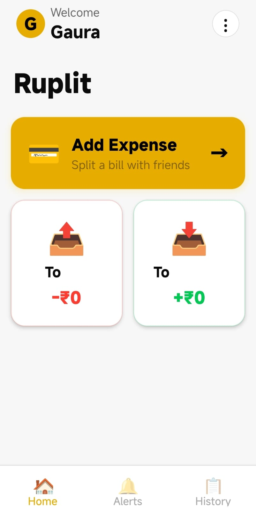
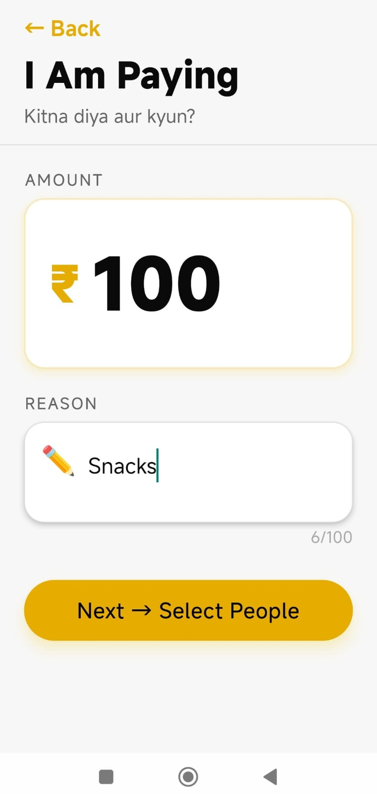
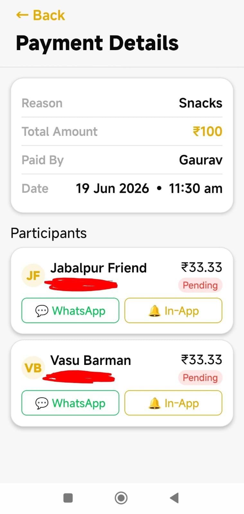
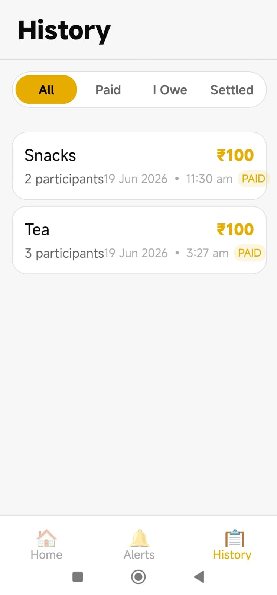
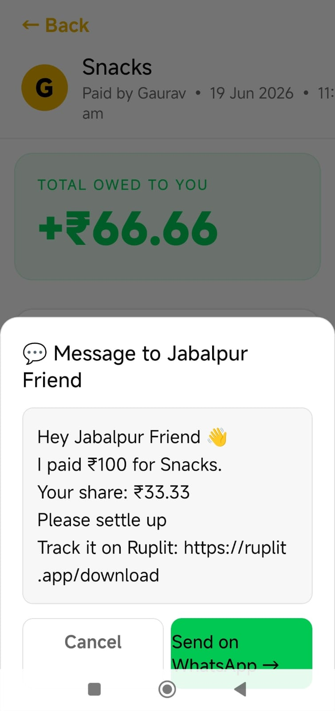

# Ruplit-showcase

# Ruplit

A modern expense splitting mobile application , built using Java, Spring Boot and React Native.

Ruplit helps users manage shared expenses with friends, roommates and groups through a secure authentication system. Users can create groups, add expenses, track balances, record settlements and receive payment reminders. The application follows a layered backend architecture using RESTful APIs and PostgreSQL for reliable data management.

This project was built to gain practical experience in backend development, authentication, database design, REST APIs and deployment of a full-stack application.

---

## Features

- Secure JWT Authentication
- User Registration & Login
- Group Creation & Management
- Shared Expense Management
- Settlement Tracking
- Payment History
- WhatsApp Payment Reminders
- User Profiles
- RESTful API Architecture
- PostgreSQL Database Integration

---

# Tech Stack

## Backend

- Java
- Spring Boot
- Spring Security
- Spring Data JPA
- Hibernate
- JWT Authentication

## Frontend

- React Native
- Expo

## Database

- PostgreSQL (Neon)

## Tools

- Git
- Maven
- Postman
- ngrok
- Render

---

# Architecture

```text
React Native
        │
        ▼
    REST APIs
        │
        ▼
   Spring Boot
        │
        ▼
   Service Layer
        │
        ▼
Spring Data JPA
        │
        ▼
   PostgreSQL
```

---

# Application Screenshots

## Login


---

## Home Screen



---

## Add Expense



---

## Select People


---

## Payment Details



---

## Settlement


---

## Split Completed


---

## Expense History



---

## WhatsApp Reminder



---

# API Modules

| Module | Description |
|---------|-------------|
| Authentication | User Registration & Login |
| Users | User Profile Management |
| Groups | Create & Manage Groups |
| Expenses | Create & Track Expenses |
| Settlements | Manage Settlements |
| Notifications | Payment Reminders |

---

# Deployment

### Backend

- Spring Boot deployed on **Render**

### Database

- PostgreSQL hosted on **Neon**

### Local Development

- Backend APIs were tested locally using **ngrok** before deployment.

---

# Learning Outcomes

This project helped me gain practical experience with:

- Spring Boot application development
- REST API design
- Spring Security
- JWT Authentication
- PostgreSQL database integration
- Spring Data JPA & Hibernate
- Layered Backend Architecture
- Backend deployment using Render
- Mobile & Backend integration

---

# Future Improvements

- Expense Analytics Dashboard
- Push Notifications
- Recurring Expenses
- Offline Support
- Receipt Scanning
- Multi-Currency Support

---

## Repository Information

This repository showcases the project architecture, features, screenshots and technical overview.

The complete source code is maintained separately.

---

## Author

**Gaurav Tripathi**

GitHub: https://github.com/gaura-v19

LinkedIn: *(Add your LinkedIn URL)*

Portfolio: *(Add your Portfolio URL)*
