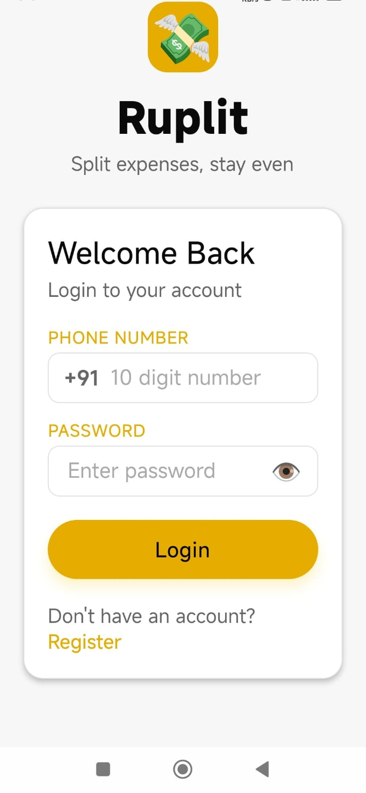
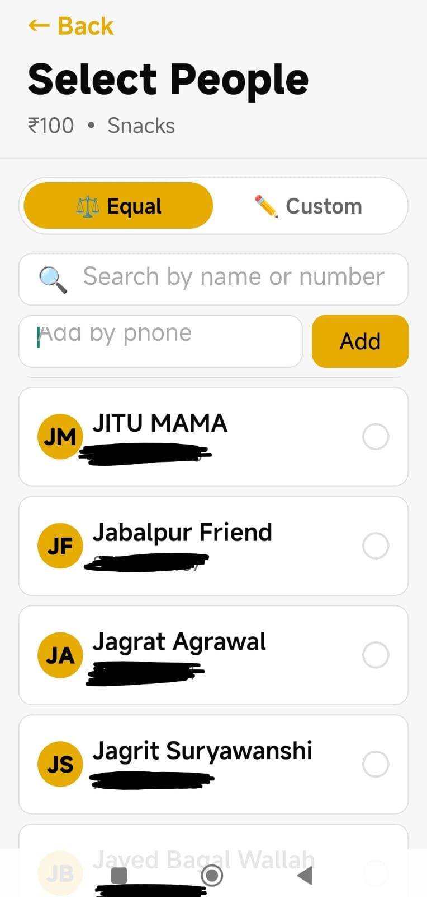
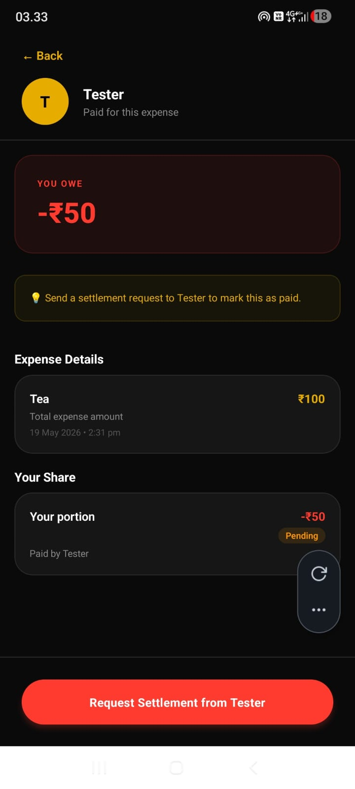

# Ruplit 💸

A mobile app for splitting expenses with friends — track shared costs, settle up, and send WhatsApp reminders.

## About This Project

Built to understand how a real end-to-end application comes together — from wireframes to a working backend and mobile frontend. I designed the full feature scope and UI flow myself, then implemented it with AI-assisted coding, debugging issues and iterating feature by feature.

## Features
- JWT-based login/signup
- Split expenses equally or custom, with registered or unregistered contacts
- Real-time balance tracking (you owe / owed to you)
- Settlement requests with approve/decline flow
- In-app notifications
- WhatsApp reminder integration

## Tech Stack
**Backend:** Java, Spring Boot, Spring Security, JWT, Redis  
**Frontend:** React Native (Expo), TypeScript, Zustand  
**Deployment:** Backend hosted on Render

## Screenshots

  
  
  

  
  
  

## What I Learned
- How a real full-stack app is structured — controller/service/repository layers, DTOs, entities
- How frontend and backend connect — auth flow, API integration, state management
- Product scoping — deciding features and edge cases before writing code
- Used Expo Go for fast iteration while testing on a real device
- Used ngrok during local development, then deployed the backend on Render

## What Can Be Improved
- Add payment gateway integration
- Add profile picture upload for users
- Write automated tests for core flows
- Improve security practices around config and secrets
- Add push notifications instead of in-app only

## More Projects
Also built 5 small static websites as early learning projects — simple HTML/CSS/JS layouts to practice fundamentals.

Check out my [GitHub profile](https://github.com/your-username) for more.

